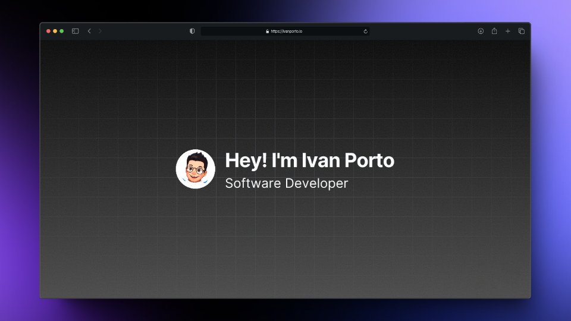

  <h1>✨ My Portfolio</h1>
  

  

  

<!-- For a bit of spacing -->

  🌐 <a href="https://ivanporto.io" target="_blank">Website</a>
  &nbsp;·&nbsp;
  🔑 <a href="https://github.com/iivvaannxx/portfolio?tab=Apache-2.0-1-ov-file#readme">License</a>

## 🔧 Stack

  
  
  
  
  
  
  
  
  
  
  
  
  

### Together with:

The primary technologies are those listed above, but I can't put every dependency from my `package.json` as a badge. For the icons, [**Tabler**](https://tabler.io/icons) and [**Simple Icons**](https://simpleicons.org/) are used for some social media icons that weren't available in the [**Lucide**](https://lucide.dev/) icon set, which is the main one. Most **_hard skill icons_** are sourced from [**svgl**](https://svgl.app/), or, if not available, from online sources.

Here are some more tools and resources used in the page that may be of interest to someone:

- 🖱️ [**Lenis**](https://lenis.darkroom.engineering/) - For a lightweight, robust and performant smooth scroll.

- ✉️ [**Resend**](https://resend.com) - The email API for developers.

- 💬 [**Tippy**](https://atomiks.github.io/tippyjs/) - The complete tooltip, popover, dropdown, and menu solution for the web.

- 🤖 [**Valibot**](https://valibot.dev) - The modular and type safe schema library for validating structural data.

## 🔗 Link Shortcuts

There are special routes of my domain that automatically redirect to some of my profiles. These are:

- **Twitter** | **X**: [ivanporto.io/twitter](https://ivanporto.io/twitter) | [ivanporto.io/x](https://ivanporto.io/x)
- **LinkedIn**: [ivanporto.io/linkedin](https://ivanporto.io/linkedin)
- **GitHub**: [ivanporto.io/github](https://ivanporto.io/github)
- **Discord**: [ivanporto.io/discord](https://ivanporto.io/discord)
- **Threads**: [ivanporto.io/threads](https://ivanporto.io/threads)
- **Resume**: [ivanporto.io/resume](https://ivanporto.io/resume)
- **Bento**: [ivanporto.io/bento](https://ivanporto.io/bento)
- **This repository**: [ivanporto.io/repo](https://ivanporto.io/repo)
